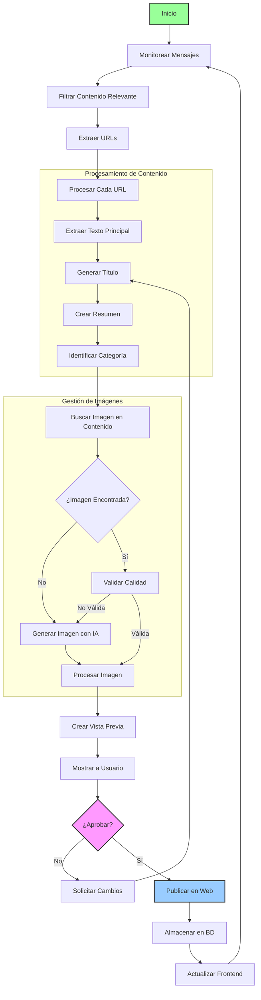

# Esquema de Implementación: Agente de Curación de Contenidos

## 1. Estructura del Proyecto
```
agente_curacion_contenidos/
│
├── .env                    # Variables de entorno
├── README.md               # Documentación del proyecto
├── requirements.txt        # Dependencias
├── .gitignore
│
├── backend/               # Aplicación Flask
│   ├── app.py              # Aplicación principal
│   ├── config.py           # Configuración
│   ├── models.py           # Modelos de base de datos
│   ├── routes.py           # Rutas de la API
│   └── database/
│       └── database.db    # Base de datos SQLite
│
├── frontend/              # Aplicación frontend
│   ├── index.html
│   ├── styles.css
│   └── app.js
│
└── agent/                 # Lógica del agente IA
    ├── __init__.py
    ├── agent.py            # Clase principal del agente
    ├── message_processor.py # Procesamiento de mensajes
    ├── content_extractor.py # Extracción de contenido web
    ├── image_handler.py    # Manejo de imágenes
    ├── web_utils.py        # Utilidades web
    └── tools/              # Herramientas personalizadas
        └── __init__.py
```

## 2. Requisitos del Sistema

### 2.1. Requisitos Previos
- Python 3.9+
- Node.js (opcional, para desarrollo frontend)
- Git (recomendado)

### 2.2. Dependencias Principales
```
# Backend
Flask==2.3.3
Flask-SQLAlchemy==3.1.1
Flask-CORS==4.0.0
python-dotenv==1.0.0
requests==2.31.0
beautifulsoup4==4.12.2
python-telegram-bot==20.6
openai==1.3.0
langchain==0.0.335
langchain-openai==0.0.2
playwright==1.38.0

# Agente
tavily-python==0.2.0
python-whatsapp==0.1.17
```

### 2.3. Variables de Entorno Necesarias
```
# API Keys
OPENAI_API_KEY=tu_api_key_de_openai
TAVILY_API_KEY=tu_api_key_de_tavily
TELEGRAM_BOT_TOKEN=tu_token_de_telegram
WHATSAPP_TOKEN=tu_token_de_whatsapp

# Configuración de la base de datos
DATABASE_URL=sqlite:///database.db
```

## 3. Plan de Implementación

### Fase 1: Configuración Inicial
1. Configurar entorno virtual
2. Instalar dependencias
3. Configurar variables de entorno
4. Inicializar repositorio Git (opcional)

### Fase 2: Desarrollo del Backend
1. Configurar aplicación Flask
2. Implementar modelos de base de datos
3. Crear endpoints de la API
4. Implementar autenticación (si es necesaria)
5. Configurar CORS

### Fase 3: Desarrollo del Frontend
1. Crear estructura básica HTML/CSS
2. Implementar funcionalidad con JavaScript
3. Conectar con la API del backend
4. Implementar diseño responsive

### Fase 4: Desarrollo del Agente IA
1. Implementar monitorización de mensajes
2. Desarrollar extractor de URLs
3. Implementar procesamiento de contenido
4. Desarrollar generador de imágenes
5. Implementar flujo de aprobación

### Fase 5: Integración y Pruebas
1. Integrar todos los componentes
2. Realizar pruebas unitarias
3. Realizar pruebas de integración
4. Optimizar rendimiento

## 4. Arquitectura del Sistema

### 4.1. Componentes Principales

1. **Agente Principal**
   - Coordina el flujo de trabajo completo
   - Gestiona la comunicación entre componentes
   - Implementa la lógica de negocio

2. **Módulo de Mensajería**
   - Monitorea canales (Telegram/WhatsApp)
   - Extrae URLs de los mensajes
   - Filtra contenido no deseado

3. **Procesador de Contenido**
   - Extrae el contenido principal de las URLs
   - Genera resúmenes con IA
   - Identifica metadatos relevantes

4. **Manejador de Imágenes**
   - Busca imágenes existentes en el contenido
   - Genera imágenes con IA cuando es necesario
   - Optimiza y almacena imágenes

5. **Interfaz de Aprobación**
   - Muestra vistas previas del contenido
   - Permite aprobar o rechazar publicaciones
   - Facilita la edición de contenido

6. **Publicador Web**
   - Almacena contenido en la base de datos
   - Actualiza la interfaz web
   - Gestiona el historial de publicaciones

### 4.2. Diagrama de Flujo Detallado



### 4.3. Flujo de Datos

1. **Entrada**
   - Mensajes de canales configurados
   - URLs extraídas
   - Configuración del usuario

2. **Procesamiento**
   - Análisis de contenido
   - Generación de resúmenes
   - Procesamiento de imágenes
   - Validación de calidad

3. **Salida**
   - Contenido estructurado
   - Imágenes optimizadas
   - Publicaciones en la web

## 5. Consideraciones de Seguridad
- No exponer claves API en el código
- Validar todas las entradas del usuario
- Implementar manejo de errores
- Usar HTTPS en producción
- Limitar tamaños de carga

## 6. Próximos Pasos

### Fase 1: Configuración Inicial (Día 1)
1. Configurar entorno virtual y dependencias
2. Inicializar repositorio Git
3. Configurar variables de entorno
4. Estructura básica del proyecto

### Fase 2: Desarrollo del Backend (Días 2-3)
1. Configurar aplicación Flask
2. Implementar modelos de base de datos
3. Desarrollar endpoints de la API
4. Configurar autenticación y CORS

### Fase 3: Módulo de Mensajería (Días 4-5)
1. Implementar conexión con Telegram/WhatsApp
2. Desarrollar sistema de monitoreo
3. Implementar extracción de URLs
4. Crear sistema de filtrado

### Fase 4: Procesamiento de Contenido (Días 6-7)
1. Desarrollar extractor de contenido web
2. Implementar generación de resúmenes
3. Crear sistema de categorización
4. Desarrollar gestión de imágenes

### Fase 5: Interfaz y Publicación (Días 8-9)
1. Desarrollar interfaz de aprobación
2. Implementar sistema de publicación
3. Crear panel de administración
4. Desarrollar frontend de visualización

### Fase 6: Pruebas y Despliegue (Día 10)
1. Realizar pruebas unitarias
2. Ejecutar pruebas de integración
3. Optimizar rendimiento
4. Documentar el proyecto
5. Preparar para despliegue

## 7. Consideraciones Adicionales

### 7.1. Escalabilidad
- Diseñar para manejar múltiples canales
- Implementar colas de procesamiento
- Considerar caché para contenido frecuente

### 7.2. Mantenimiento
- Documentar el código exhaustivamente
- Implementar logging detallado
- Crear guías de actualización

### 7.3. Monitoreo
- Implementar métricas de rendimiento
- Configurar alertas tempranas
- Realizar copias de seguridad automáticas

---
*Este documento se actualizará a medida que avance el desarrollo del proyecto.*
